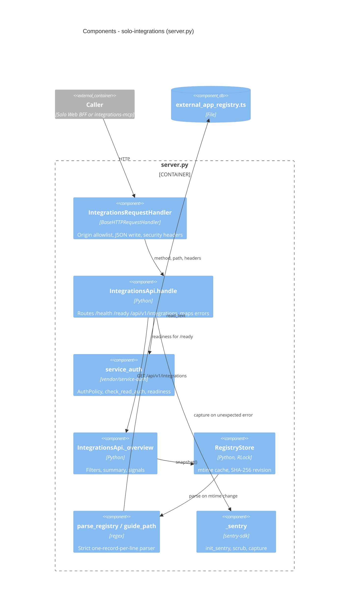
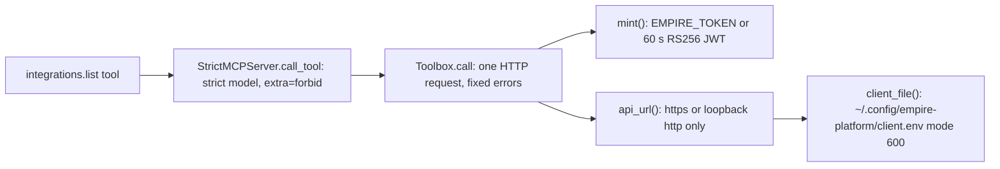

# 07 — C4 Component

```mermaid
C4Component
  title Components - solo-integrations (server.py)
  Container_Ext(caller, "Caller", "Solo Web BFF or integrations-mcp")
  Container_Boundary(api, "server.py") {
    Component(handler, "IntegrationsRequestHandler", "BaseHTTPRequestHandler", "Origin allowlist, JSON write, security headers")
    Component(router, "IntegrationsApi.handle", "Python", "Routes /health /ready /api/v1/integrations, maps errors")
    Component(auth, "service_auth", "vendor/service-auth", "AuthPolicy, check_read_auth, readiness")
    Component(overview, "IntegrationsApi._overview", "Python", "Filters, summary, signals")
    Component(store, "RegistryStore", "Python, RLock", "mtime cache, SHA-256 revision")
    Component(parser, "parse_registry / guide_path", "regex", "Strict one-record-per-line parser")
    Component(sentry, "_sentry", "sentry-sdk", "init_sentry, scrub, capture")
  }
  ComponentDb(file, "external_app_registry.ts", "File")
  Rel(caller, handler, "HTTP")
  Rel(handler, router, "method, path, headers")
  Rel(router, auth, "check_read_auth")
  Rel(router, overview, "GET /api/v1/integrations")
  Rel(router, auth, "readiness for /ready")
  Rel(overview, store, "snapshot()")
  Rel(store, parser, "parse on mtime change")
  Rel(parser, file, "read_text")
  Rel(router, sentry, "capture on unexpected error")
```

Sources: `server.py`, `vendor/service-auth/service_auth/__init__.py`, `_sentry.py`

## integrations-mcp components

```mermaid
flowchart LR
  T["integrations.list tool"] --> S["StrictMCPServer.call_tool: strict model, extra=forbid"]
  S --> B["Toolbox.call: one HTTP request, fixed errors"]
  B --> M["mint(): EMPIRE_TOKEN or 60 s RS256 JWT"]
  B --> U["api_url(): https or loopback http only"]
  U --> CF["client_file(): ~/.config/empire-platform/client.env mode 600"]
```

Sources: `integrations_mcp.py`
